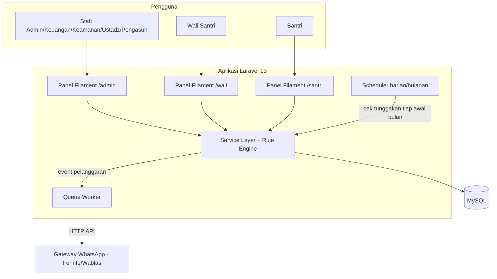
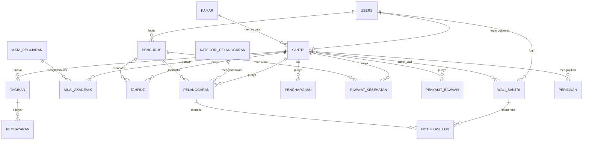

# PRD: Sistem Aplikasi Manajemen Santri Berbasis Web
### Pondok Pesantren Miftahul Ihsan

| | |
|---|---|
| **Versi dokumen** | 1.0 |
| **Tanggal** | 27 Juli 2026 |
| **Disusun berdasarkan** | Proposal skripsi "Implementasi Metode Rule-Based pada Sistem Aplikasi Manajemen Santri Berbasis Web dengan Fitur RBAC di Pondok Pesantren Miftahul Ihsan" |
| **Tumpukan teknologi target** | Laravel 13, Filament, paket-paket Spatie |
| **Status** | Draf untuk pengembangan |

---

## Daftar Isi

1. [Ringkasan Produk](#1-ringkasan-produk)
2. [Latar Belakang & Masalah](#2-latar-belakang--masalah)
3. [Tujuan Produk](#3-tujuan-produk)
4. [Ruang Lingkup](#4-ruang-lingkup)
5. [Prinsip Desain Teknis](#5-prinsip-desain-teknis)
6. [Peran Pengguna](#6-peran-pengguna)
7. [Tumpukan Teknologi](#7-tumpukan-teknologi)
8. [Arsitektur Sistem](#8-arsitektur-sistem)
9. [Modul Fungsional](#9-modul-fungsional)
10. [Rule Engine (Metode Rule-Based)](#10-rule-engine-metode-rule-based)
11. [Struktur Basis Data](#11-struktur-basis-data)
12. [Model Eloquent](#12-model-eloquent)
13. [Matriks Peran & Permission](#13-matriks-peran--permission)
14. [Pemetaan Resource Filament](#14-pemetaan-resource-filament)
15. [Kebutuhan Non-Fungsional](#15-kebutuhan-non-fungsional)
16. [Peta Jalan Pengembangan](#16-peta-jalan-pengembangan)
17. [Asumsi & Keputusan Terbuka](#17-asumsi--keputusan-terbuka)
18. [Daftar Paket Composer](#18-daftar-paket-composer)

---

## 1. Ringkasan Produk

Sistem manajemen santri berbasis web untuk Pondok Pesantren Miftahul Ihsan. Sistem ini menyatukan data yang sekarang tersebar di bagian tata usaha, keuangan, keamanan, dan pengasuhan ke satu platform, mengatur siapa boleh mengakses apa lewat RBAC, dan mengotomatiskan keputusan rutin (blokir izin saat nunggak, eskalasi pelanggaran, tandai tunggakan bulanan) lewat kumpulan aturan if-then yang eksplisit dan bisa diaudit.

Tiga pilar produk ini:

1. **Data terpusat** — satu sumber kebenaran untuk data santri, akademik, tahfidz, kedisiplinan, kesehatan, dan keuangan.
2. **RBAC granular** — delapan peran, masing-masing hanya melihat dan mengubah apa yang jadi tanggung jawabnya.
3. **Rule engine eksplisit** — keputusan otomatis (tolak izin, kirim peringatan, eskalasi ke pengasuh) yang aturannya tertulis jelas di kode, bukan logika tersembunyi di controller.

## 2. Latar Belakang & Masalah

Observasi dan wawancara terhadap pengasuh, tata usaha, keamanan, keuangan, ustadz, wali santri, dan santri sendiri menunjukkan pola yang sama: setiap bagian mencatat datanya sendiri-sendiri, tidak ada yang terhubung.

Masalah konkret yang muncul dari wawancara tersebut:

- Pengasuh baru tahu ada pelanggaran atau tunggakan setelah laporan manual sampai ke mejanya, sering terlambat.
- Tata usaha menyimpan data santri di banyak arsip terpisah; pencarian satu data bisa memakan waktu lama.
- Keamanan mencatat pelanggaran dan perizinan di buku catatan, sulit dipantau berkala dan gampang telat menyampaikan ke wali.
- Keuangan mencatat pembayaran manual, rawan salah catat, dan wali santri kesulitan mengecek status tagihan.
- Ustadz tidak punya satu tempat untuk melihat nilai, tahfidz, dan pelanggaran santri yang sama sekaligus.
- Wali santri hanya dapat informasi kalau datang langsung ke pesantren.
- Tidak ada sistem hak akses yang jelas, jadi siapa saja berpotensi mengakses data yang bukan urusannya.

Dokumen sumber juga menetapkan tiga batasan penting yang PRD ini pertahankan: sistem berbasis web (bukan mobile), kontrol akses memakai RBAC, dan WhatsApp Bot hanya untuk notifikasi pelanggaran ke wali santri, bukan untuk data akademik, keuangan, atau kesehatan.

## 3. Tujuan Produk

1. Merancang satu sistem web yang mengelola data santri secara terintegrasi: identitas, akademik, tahfidz, kedisiplinan, kesehatan, keuangan, dan perizinan.
2. Menerapkan RBAC supaya tiap pengguna hanya mengakses menu dan data sesuai perannya.
3. Menerapkan metode rule-based untuk keputusan otomatis yang selama ini dilakukan manual dan tidak konsisten (verifikasi izin, eskalasi pelanggaran, penandaan tunggakan).
4. Mengirim notifikasi WhatsApp otomatis ke wali santri saat terjadi pelanggaran, sesuai batasan yang ditetapkan.
5. Membangun semuanya di atas Laravel 13, dengan Filament sebagai lapisan admin panel dan paket-paket Spatie menangani kebutuhan pendukung (permission, media, activity log, settings), supaya kode custom yang perlu ditulis dan dirawat seminim mungkin.

## 4. Ruang Lingkup

### 4.1 Termasuk

- Pengelolaan data santri, wali santri, kamar, dan pengurus.
- Pencatatan akademik (nilai per mata pelajaran) dan tahfidz (setoran & murojaah).
- Pencatatan pelanggaran dan penghargaan dengan poin otomatis.
- Riwayat kesehatan dan penyakit bawaan.
- Pembayaran SPP/iuran dan pengecekan tunggakan otomatis bulanan.
- Pengajuan dan verifikasi izin keluar pondok, dengan aturan tunggakan sebagai gerbang otomatis.
- Notifikasi WhatsApp Bot khusus untuk pelanggaran.
- Halaman matriks akses global untuk mengatur permission per peran.
- Dashboard berbeda per peran (admin, pengurus per bagian, wali santri, santri).

### 4.2 Tidak Termasuk

- Aplikasi mobile (native atau hybrid). Web responsif saja.
- WhatsApp Bot untuk data akademik, keuangan, atau kesehatan.
- Aspek keamanan sistem di luar kontrol hak akses (mis. penetration testing, WAF, infrastruktur jaringan) — di luar cakupan dokumen sumber, jadi di luar cakupan PRD ini juga.
- Fitur AI/LLM. Dokumen sumber secara eksplisit memilih pendekatan rule-based (if-then) sebagai pembeda, bukan machine learning, jadi Laravel AI SDK yang dibawa Laravel 13 sengaja tidak dipakai di sini meski tersedia.

## 5. Prinsip Desain Teknis

Karena diminta memaksimalkan Filament dan Spatie, PRD ini mengikuti tiga aturan desain:

1. **Filament dulu, Blade custom belakangan.** Setiap kebutuhan CRUD dan dashboard lewat Filament Resource, Page, atau Widget. Blade/Livewire custom hanya untuk sesuatu yang benar-benar tidak bisa dilakukan Filament (praktis tidak ada di sistem ini).
2. **Spatie untuk masalah yang sudah dipecahkan orang lain.** Permission, upload file, audit trail, dan pengaturan konfigurasi pakai paket Spatie yang relevan, bukan tabel dan logika custom baru.
3. **Rule engine terpisah dari controller.** Aturan bisnis (tunggakan memblokir izin, poin memicu eskalasi) hidup sebagai kelas tersendiri yang bisa dites satuan, bukan tercampur di dalam method Filament Resource. Ini yang membuat sistem benar-benar "rule-based" sesuai judul skripsi, bukan sekadar if-else yang tersebar.

## 6. Peran Pengguna

Dokumen sumber menyebut lima peran untuk modul perizinan (Administrator, Operator, Pengurus Pondok, Wali Santri, Pengasuh) tapi hasil wawancara menunjukkan struktur organisasi yang lebih rinci: tata usaha, keuangan, keamanan, dan ustadz masing-masing punya tanggung jawab data yang berbeda. PRD ini memakai delapan peran supaya permission benar-benar mencerminkan siapa mengurus apa:

| Peran | Tanggung jawab utama |
|---|---|
| **Super Admin** | Konfigurasi sistem, kelola user, kelola role & permission, data master |
| **Admin/Tata Usaha** | Registrasi santri, data wali, data kamar |
| **Bagian Keuangan** | Tagihan, pembayaran, laporan tunggakan |
| **Pengurus Keamanan** | Pelanggaran, verifikasi & approval perizinan |
| **Ustadz/Guru** | Nilai akademik, tahfidz |
| **Pengasuh** | Lihat semua data, penghargaan, penanganan eskalasi pelanggaran, rujukan kesehatan berat |
| **Wali Santri** | Lihat data anak asuh saja (read-only), semua modul |
| **Santri** | Lihat profil sendiri, ajukan izin, lihat status pengajuan |

Peran kesehatan sengaja tidak dipisah sendiri — dari wawancara, pencatatan kesehatan ditangani pengurus yang sama dengan keamanan/pengasuhan sehari-hari. Kalau di lapangan ada penanggung jawab kesehatan khusus, tinggal tambah satu role baru lewat matriks akses; tidak perlu ubah struktur tabel.

## 7. Tumpukan Teknologi

| Komponen | Pilihan | Catatan |
|---|---|---|
| Framework | Laravel 13 (rilis 17 Maret 2026) | Perlu PHP 8.3+, tanpa breaking changes dari Laravel 12 |
| Admin panel | Filament v5 | Fungsional identik dengan v4, bedanya cuma dukungan Livewire v4. Filament v4 juga masih valid kalau mau tetap di Livewire v3 |
| RBAC | spatie/laravel-permission v8 | Kompatibel Laravel 12+, sudah ada dukungan resmi untuk Laravel 13 |
| Integrasi RBAC + Filament | bezhansalleh/filament-shield | Auto-generate halaman Role dengan matriks permission per resource/page/widget — ini yang jadi "Halaman Matriks Akses Global" di desain antarmuka dokumen sumber |
| Upload file | spatie/laravel-medialibrary | Foto profil santri, bukti pembayaran |
| Audit trail | spatie/laravel-activitylog | Log perubahan pada data sensitif (pelanggaran, pembayaran, role) |
| Pengaturan aturan | spatie/laravel-settings | Threshold poin pelanggaran, batas percobaan login, dsb — bisa diubah admin tanpa deploy ulang |
| Database | MySQL 8+ | Sesuai kebutuhan nonfungsional dokumen sumber |
| Queue | Database driver (cukup untuk skala pesantren) atau Redis bila trafik naik | Untuk kirim notifikasi WhatsApp secara asinkron |
| Scheduler | Laravel Task Scheduling | Menjalankan pengecekan tunggakan otomatis tiap awal bulan |
| Gateway WhatsApp | Fonnte atau Wablas (pilih satu) | Keduanya API HTTP sederhana untuk pesan keluar, umum dipakai proyek Laravel Indonesia. Meta WhatsApp Cloud API jadi opsi resmi kalau butuh verifikasi bisnis |

**Lingkungan pengembangan.** Dokumen sumber menyebut XAMPP untuk lokal. Karena proyek ini berjalan di mesin Fedora dengan Docker CE yang sudah terpasang, Laravel Sail (Docker Compose bawaan Laravel) lebih pas daripada XAMPP — konsisten dengan tumpukan self-hosted yang sudah ada, dan environment produksi jadi lebih dekat dengan environment lokal.

## 8. Arsitektur Sistem

Filament mendukung banyak panel dalam satu instalasi Laravel. Sistem ini pakai tiga panel dengan guard dan resource yang terpisah, jadi satu basis kode melayani tiga jenis pengguna tanpa harus membangun portal terpisah:

- **`/admin`** — Super Admin, Tata Usaha, Keuangan, Keamanan, Ustadz, Pengasuh
- **`/wali`** — Wali Santri, akses read-only ke data anak asuhnya
- **`/santri`** — Santri, profil sendiri + pengajuan izin



Ketiga panel berbagi tabel `users` yang sama, dibedakan lewat role Spatie. Filament Shield mengunci navigasi dan resource per panel berdasarkan permission, jadi santri secara fisik tidak bisa melihat resource milik staf meski satu basis kode.

## 9. Modul Fungsional

Tiap modul berikut ditulis dengan format: deskripsi, peran yang terlibat, dan aturan bisnis yang menempel (kalau ada).

### 9.1 Autentikasi & Kontrol Akses

Login pakai username + password (sesuai flowchart login dokumen sumber, bukan email). Tiga kali gagal berturut-turut mengunci akun sementara. Setelah berhasil, sistem mengarahkan ke panel sesuai role — staf ke `/admin`, wali ke `/wali`, santri ke `/santri`.

- **Peran terlibat:** semua peran.
- **Aturan bisnis:** R4 — lihat [Bagian 10](#10-rule-engine-metode-rule-based).

### 9.2 Manajemen Data Master

Kamar (nama, kapasitas, pembina), mata pelajaran, dan kategori pelanggaran (nama + bobot poin) dikelola di sini. Kategori pelanggaran perlu tabel referensi sendiri karena dokumen sumber menyebut "menghitung poin pelanggaran secara otomatis berdasarkan kategori" — artinya bobot poin per kategori harus tersimpan di satu tempat, bukan diketik ulang tiap kali input.

- **Peran terlibat:** Super Admin, Admin/Tata Usaha.

### 9.3 Manajemen Santri & Wali

Registrasi santri baru menghasilkan NIS otomatis dan langsung membuat akun untuk wali santri (username + password default, role Wali Santri). Satu wali bisa terhubung ke lebih dari satu santri (kakak-adik di pondok yang sama), dan sebaliknya satu santri bisa punya lebih dari satu wali (ayah dan ibu) — makanya relasinya many-to-many, bukan satu kolom `wali_id` di tabel santri.

- **Peran terlibat:** Admin/Tata Usaha (kelola), Pengasuh & Ustadz (lihat), Wali Santri (lihat anak sendiri).
- **Aturan bisnis:** validasi kelengkapan data sebelum simpan; NIS di-generate sistem, bukan input manual.

### 9.4 Akademik

Input nilai per santri, mata pelajaran, semester, dan tahun ajaran. Rentang nilai divalidasi 0–100 sesuai flowchart dokumen sumber.

- **Peran terlibat:** Ustadz/Guru (input), Pengasuh & Wali Santri (lihat).

### 9.5 Tahfidz

Mencatat dua jenis kegiatan: setoran hafalan baru dan murojaah (pengulangan). Tiap catatan dinilai lulus/tidak lulus. Kalau tidak lulus, statusnya otomatis "perlu murojaah". Saat total hafalan santri menyentuh milestone tertentu, sistem mencatat penghargaan otomatis dan mengirim notifikasi ke pengasuh dan wali santri.

- **Peran terlibat:** Ustadz/Guru (input), Pengasuh & Wali Santri (lihat).
- **Aturan bisnis:** R5, R6 — lihat [Bagian 10](#10-rule-engine-metode-rule-based).

### 9.6 Kedisiplinan (Pelanggaran & Penghargaan)

Pelanggaran dicatat dengan kategori (bobot poin sudah tersimpan di data master), deskripsi, dan tanggal kejadian. Sistem menjumlahkan poin santri secara otomatis dan bereaksi berdasarkan ambang batas: peringatan ke wali di atas 50 poin, eskalasi ke pengasuh di atas 100 poin. Penghargaan dicatat terpisah, dengan empat bidang: akademik, tahfidz, kedisiplinan, lomba.

- **Peran terlibat:** Pengurus Keamanan (input pelanggaran), Pengasuh (terima eskalasi, input penghargaan), Wali Santri (lihat).
- **Aturan bisnis:** R2, R3 — lihat [Bagian 10](#10-rule-engine-metode-rule-based). Ini modul inti dari "rule-based system" di judul skripsi.

### 9.7 Kesehatan

Pengurus mencatat kejadian sakit: keluhan, suhu tubuh, diagnosis sementara, dan tindakan (istirahat kamar, obat, mini puskesmas, atau rujuk rumah sakit). Riwayat penyakit bawaan tampil otomatis saat pengurus membuka data santri yang sakit, jadi keputusan penanganan tidak buta konteks. Notifikasi ke wali santri bersifat kondisional — hanya dikirim kalau kondisi memang perlu diberitahukan (mis. rujukan), bukan tiap kali batuk pilek.

Data ini paling sensitif di seluruh sistem. Permission-nya dibuat lebih ketat daripada modul lain: hanya pengurus terkait, pengasuh, dan wali santri dari santri bersangkutan yang bisa melihat.

- **Peran terlibat:** Pengurus (input), Pengasuh & Wali Santri (lihat).

### 9.8 Keuangan

Tagihan (SPP bulanan, daftar ulang, lainnya) dan pembayaran adalah dua tabel terpisah, supaya cicilan/pembayaran sebagian bisa dilacak terhadap satu tagihan yang sama. Kalau jumlah bayar kurang dari nominal tagihan, statusnya "sebagian"; kalau cukup atau lebih, "lunas". Tiap awal bulan, scheduler otomatis memeriksa semua santri aktif, menandai yang masih punya tagihan belum lunas dari bulan sebelumnya, dan mengirim pengingat ke wali santri.

- **Peran terlibat:** Bagian Keuangan (kelola), Wali Santri (lihat status & bayar).
- **Aturan bisnis:** R7, R8 — lihat [Bagian 10](#10-rule-engine-metode-rule-based).

### 9.9 Perizinan

Santri (atau wali atas nama santri) mengajukan izin keluar pondok dengan jenis, tanggal, dan alasan. Sebelum pengajuan bahkan masuk status "diajukan", sistem mengecek tunggakan santri tersebut. Ada tunggakan, pengajuan ditolak otomatis dengan pesan yang jelas kenapa. Tidak ada tunggakan, pengajuan lanjut ke Pengurus Keamanan untuk verifikasi dan persetujuan.

- **Peran terlibat:** Santri (ajukan), Pengurus Keamanan (verifikasi & setuju/tolak), Wali Santri (lihat status).
- **Aturan bisnis:** R1 — lihat [Bagian 10](#10-rule-engine-metode-rule-based). Ini contoh rule-based system paling eksplisit di dokumen sumber (`IF tunggakan pembayaran > 0 THEN izin santri ditolak`).

### 9.10 Notifikasi WhatsApp Bot

Sesuai batasan masalah, trigger notifikasi WhatsApp hanya satu: pelanggaran santri, dikirim ke wali santri. Bukan bot percakapan dua arah — cukup pengiriman pesan keluar (outbound) lewat gateway pihak ketiga, dipicu event, dieksekusi lewat queue supaya tidak memperlambat proses input pengurus.

- **Peran terlibat:** sistem (otomatis), Wali Santri (penerima).
- **Batasan eksplisit:** tidak menyentuh data akademik, keuangan, atau kesehatan — sesuai batasan masalah dokumen sumber.

### 9.11 Dashboard

Tiap panel Filament punya widget berbeda sesuai kebutuhan role:

| Panel | Widget utama |
|---|---|
| `/admin` (Super Admin/Tata Usaha) | Jumlah santri aktif, santri baru bulan ini, distribusi kamar |
| `/admin` (Keuangan) | Total tunggakan bulan berjalan, grafik pembayaran masuk |
| `/admin` (Keamanan) | Pelanggaran terbaru, izin menunggu verifikasi |
| `/admin` (Pengasuh) | Eskalasi pelanggaran aktif, penghargaan terbaru, rujukan kesehatan aktif |
| `/wali` | Ringkasan anak asuh: status tunggakan, pelanggaran terakhir, status izin |
| `/santri` | Status pengajuan izin, ringkasan nilai & tahfidz terbaru |

## 10. Rule Engine (Metode Rule-Based)

### 10.1 Pola implementasi

Tiap aturan jadi satu kelas kecil yang mengimplementasikan interface yang sama. Rule dievaluasi sebelum sebuah aksi (pengajuan izin, pencatatan pelanggaran, penilaian tahfidz) dieksekusi, dan orkestrasinya ada di Service class, terpisah dari Filament Resource. Ini yang membuat aturan gampang ditambah atau diubah tanpa menyentuh sisa sistem, persis klaim yang dipakai dokumen sumber untuk membenarkan pendekatan rule-based.

```php
// app/Domain/Rules/Contracts/BusinessRule.php
namespace App\Domain\Rules\Contracts;

interface BusinessRule
{
    public function passes(mixed $subject): bool;
    public function message(): string;
}
```

```php
// app/Domain/Rules/Perizinan/TidakAdaTunggakanRule.php
namespace App\Domain\Rules\Perizinan;

use App\Domain\Rules\Contracts\BusinessRule;
use App\Models\Santri;

final class TidakAdaTunggakanRule implements BusinessRule
{
    public function passes(mixed $subject): bool
    {
        /** @var Santri $subject */
        return $subject->tagihan()
            ->whereIn('status', ['belum_lunas', 'sebagian'])
            ->doesntExist();
    }

    public function message(): string
    {
        return 'Santri masih memiliki tunggakan pembayaran, pengajuan izin ditolak.';
    }
}
```

```php
// app/Domain/Perizinan/PerizinanService.php
namespace App\Domain\Perizinan;

use App\Domain\Rules\Contracts\BusinessRule;
use App\Domain\Rules\Perizinan\TidakAdaTunggakanRule;
use App\Exceptions\RuleViolationException;
use App\Models\{Perizinan, Santri};

final class PerizinanService
{
    /** @param BusinessRule[] $rules */
    public function __construct(
        private readonly array $rules = [new TidakAdaTunggakanRule()],
    ) {}

    public function ajukan(Santri $santri, array $data): Perizinan
    {
        foreach ($this->rules as $rule) {
            if (! $rule->passes($santri)) {
                throw new RuleViolationException($rule->message());
            }
        }

        return $santri->perizinan()->create([...$data, 'status' => 'diajukan']);
    }
}
```

Ambang batas yang sifatnya angka (poin peringatan, poin kritis, batas gagal login) tidak di-hardcode, tapi disimpan lewat `spatie/laravel-settings` supaya Super Admin bisa mengubahnya lewat Filament tanpa minta developer deploy ulang:

```php
// app/Settings/KedisiplinanSettings.php
namespace App\Settings;

use Spatie\LaravelSettings\Settings;

class KedisiplinanSettings extends Settings
{
    public int $poin_peringatan;
    public int $poin_kritis;

    public static function group(): string
    {
        return 'kedisiplinan';
    }
}
```

### 10.2 Daftar aturan bisnis

Semua aturan berikut diturunkan langsung dari flowchart di dokumen sumber (BAB III):

| ID | Aturan | Modul | Lokasi implementasi |
|---|---|---|---|
| R1 | Tunggakan pembayaran > 0 → tolak pengajuan izin | Perizinan | `TidakAdaTunggakanRule` |
| R2 | Total poin pelanggaran > `poin_peringatan` (default 50) → kirim notifikasi WhatsApp ke wali, status "peringatan" | Kedisiplinan | `PelanggaranObserver` / event listener |
| R3 | Total poin pelanggaran > `poin_kritis` (default 100) → eskalasi ke pengasuh, status "perlu tindakan" | Kedisiplinan | `PelanggaranObserver` / event listener |
| R4 | 3 kali gagal login berturut-turut → kunci akun sementara | Autentikasi | Custom Fortify/Filament login response |
| R5 | Penilaian tahfidz "tidak lulus" → status "perlu murojaah" | Tahfidz | `TahfidzService` |
| R6 | Total hafalan mencapai milestone → catat penghargaan otomatis + notifikasi pengasuh & wali | Tahfidz | `TahfidzService` + event |
| R7 | Jumlah bayar < nominal tagihan → status "sebagian"; jumlah bayar ≥ nominal → status "lunas" | Keuangan | `PembayaranService` |
| R8 | Awal bulan: santri dengan tagihan belum lunas bulan sebelumnya → tandai tunggakan + notifikasi wali | Keuangan | `CekTunggakanBulanan` (scheduled job) |

### 10.3 Prinsip tambahan

Rule yang butuh angka konfigurasi (R2, R3, R4) membaca dari Settings, bukan konstanta di kode — jadi pesantren bisa menyesuaikan kebijakan kedisiplinan sendiri dari waktu ke waktu tanpa perubahan kode. Rule yang murni struktural (R1, R5, R7) boleh tetap sebagai logika tetap karena sifatnya definisi, bukan kebijakan yang berubah-ubah.

## 11. Struktur Basis Data

### 11.1 Diagram ERD



Catatan: `roles`, `permissions`, `model_has_roles`, `model_has_permissions`, `role_has_permissions` dikelola otomatis oleh `spatie/laravel-permission`, tidak digambar di ERD ini karena strukturnya baku dari paket. Tabel `media` (spatie/laravel-medialibrary) dan `activity_log` (spatie/laravel-activitylog) sama, otomatis dari paket.

### 11.2 Definisi Tabel

Tabel `kategori_pelanggaran`, `mata_pelajaran`, `santri_wali`, dan `notifikasi_log` tidak eksplisit disebut sebagai entitas di BAB III dokumen sumber, tapi diperlukan supaya relasi yang dideskripsikan di sana (poin per kategori, mata pelajaran pada nilai akademik, satu wali untuk banyak santri) bisa berjalan dengan integritas data yang benar. Ditandai **(tambahan)** di bawah.

#### Autentikasi

**`users`**

| Kolom | Tipe | Keterangan |
|---|---|---|
| id | bigint, PK | |
| name | string | |
| username | string, unique | dipakai untuk login, sesuai flowchart |
| email | string, unique, nullable | |
| password | string | hashed |
| is_active | boolean, default true | |
| failed_login_attempts | tinyInteger unsigned, default 0 | mendukung R4 |
| locked_until | timestamp, nullable | mendukung R4 |
| last_login_at | timestamp, nullable | |
| timestamps | | |

Role tidak disimpan sebagai kolom FK di sini — ditangani lewat tabel pivot `model_has_roles` milik spatie/laravel-permission.

#### Data Master

**`kamar`**

| Kolom | Tipe | Keterangan |
|---|---|---|
| id | bigint, PK | |
| nama_kamar | string | |
| kapasitas | integer unsigned | |
| pengurus_pembina_id | FK → pengurus.id, nullable | |
| keterangan | text, nullable | |
| timestamps | | |

**`mata_pelajaran`** *(tambahan)*

| Kolom | Tipe | Keterangan |
|---|---|---|
| id | bigint, PK | |
| nama_mapel | string | |
| timestamps | | |

**`kategori_pelanggaran`** *(tambahan)*

| Kolom | Tipe | Keterangan |
|---|---|---|
| id | bigint, PK | |
| nama_kategori | string | |
| poin | integer unsigned | bobot poin per kategori, dipakai R2/R3 |
| timestamps | | |

#### Santri & Keluarga

**`santri`**

| Kolom | Tipe | Keterangan |
|---|---|---|
| id | bigint, PK | |
| user_id | FK → users.id, nullable | akun login santri, dibuat sesuai kebutuhan |
| nis | string, unique | digenerate sistem saat registrasi |
| nama_lengkap | string | |
| tempat_lahir | string | |
| tanggal_lahir | date | |
| jenis_kelamin | enum: L, P | |
| alamat | text | |
| asal_sekolah | string, nullable | |
| kamar_id | FK → kamar.id, nullable | |
| status | enum: aktif, nonaktif, lulus, keluar — default aktif | |
| tanggal_masuk | date | |
| timestamps | | |

Foto profil ditangani lewat collection media spatie/laravel-medialibrary (`foto_profil`), bukan kolom string.

**`wali_santri`**

| Kolom | Tipe | Keterangan |
|---|---|---|
| id | bigint, PK | |
| user_id | FK → users.id | akun login wali, dibuat otomatis saat registrasi santri |
| nama | string | |
| no_hp | string | target pengiriman notifikasi WhatsApp |
| pekerjaan | string, nullable | |
| timestamps | | |

**`santri_wali`** *(tambahan, tabel pivot)*

| Kolom | Tipe | Keterangan |
|---|---|---|
| id | bigint, PK | |
| santri_id | FK → santri.id | |
| wali_santri_id | FK → wali_santri.id | |
| hubungan | enum: ayah, ibu, wali_lain | |
| is_penanggung_jawab_utama | boolean, default false | penerima notifikasi utama |
| timestamps | | |

Relasi many-to-many: satu wali bisa menaungi lebih dari satu santri (kakak-beradik), satu santri bisa punya lebih dari satu wali (ayah dan ibu).

**`pengurus`**

| Kolom | Tipe | Keterangan |
|---|---|---|
| id | bigint, PK | |
| user_id | FK → users.id | |
| nama | string | |
| bagian | enum: tata_usaha, keuangan, keamanan, akademik, tahfidz, kesehatan, pengasuhan | |
| no_hp | string, nullable | |
| timestamps | | |

#### Akademik & Tahfidz

**`nilai_akademik`**

| Kolom | Tipe | Keterangan |
|---|---|---|
| id | bigint, PK | |
| santri_id | FK → santri.id | |
| mata_pelajaran_id | FK → mata_pelajaran.id | |
| pengurus_id | FK → pengurus.id | siapa yang menginput |
| semester | tinyInteger | 1 atau 2 |
| tahun_ajaran | string | format "2025/2026" |
| nilai | decimal(5,2) | tervalidasi 0–100 |
| keterangan | text, nullable | |
| timestamps | | |

**`tahfidz`**

| Kolom | Tipe | Keterangan |
|---|---|---|
| id | bigint, PK | |
| santri_id | FK → santri.id | |
| pengurus_id | FK → pengurus.id | |
| jenis | enum: setoran, murojaah | |
| surat | string | |
| juz | tinyInteger unsigned, nullable | |
| ayat_dari | integer unsigned, nullable | |
| ayat_sampai | integer unsigned, nullable | |
| status | enum: lulus, tidak_lulus | menentukan R5 |
| catatan | text, nullable | |
| tanggal | date | |
| timestamps | | |

#### Kedisiplinan

**`pelanggaran`**

| Kolom | Tipe | Keterangan |
|---|---|---|
| id | bigint, PK | |
| santri_id | FK → santri.id | |
| kategori_pelanggaran_id | FK → kategori_pelanggaran.id | |
| pengurus_id | FK → pengurus.id | |
| deskripsi | text | |
| tanggal_kejadian | date | |
| poin | integer unsigned | snapshot poin kategori saat dicatat |
| status | enum: normal, peringatan, perlu_tindakan — default normal | hasil evaluasi R2/R3 |
| timestamps | | |

**`penghargaan`**

| Kolom | Tipe | Keterangan |
|---|---|---|
| id | bigint, PK | |
| santri_id | FK → santri.id | |
| pengurus_id | FK → pengurus.id | |
| bidang | enum: akademik, tahfidz, kedisiplinan, lomba | |
| deskripsi | text | |
| tanggal | date | |
| timestamps | | |

#### Kesehatan

**`penyakit_bawaan`**

| Kolom | Tipe | Keterangan |
|---|---|---|
| id | bigint, PK | |
| santri_id | FK → santri.id | |
| nama_penyakit | string | |
| keterangan | text, nullable | |
| timestamps | | |

**`riwayat_kesehatan`**

| Kolom | Tipe | Keterangan |
|---|---|---|
| id | bigint, PK | |
| santri_id | FK → santri.id | |
| pengurus_id | FK → pengurus.id | |
| tanggal_kejadian | date | |
| keluhan | text | |
| suhu_tubuh | decimal(4,1), nullable | |
| diagnosis_sementara | text, nullable | |
| tindakan | enum: istirahat_kamar, pemberian_obat, mini_puskesmas, rujuk_rs | |
| tujuan_rujukan | string, nullable | diisi kalau dirujuk |
| status | enum: dalam_perawatan, dirujuk, selesai — default dalam_perawatan | |
| timestamps | | |

#### Keuangan

**`tagihan`**

| Kolom | Tipe | Keterangan |
|---|---|---|
| id | bigint, PK | |
| santri_id | FK → santri.id | |
| jenis | enum: spp, daftar_ulang, lainnya | |
| bulan | tinyInteger unsigned, nullable | 1–12, untuk SPP bulanan |
| tahun | smallInteger unsigned | |
| nominal | decimal(12,2) | |
| status | enum: belum_lunas, sebagian, lunas — default belum_lunas | hasil evaluasi R7 |
| jatuh_tempo | date, nullable | |
| timestamps | | |

**`pembayaran`**

| Kolom | Tipe | Keterangan |
|---|---|---|
| id | bigint, PK | |
| tagihan_id | FK → tagihan.id | |
| santri_id | FK → santri.id | denormalisasi untuk laporan |
| jumlah_bayar | decimal(12,2) | |
| tanggal_bayar | date | |
| metode_pembayaran | enum: tunai, transfer, qris | |
| admin_id | FK → users.id | siapa yang memproses |
| timestamps | | |

Bukti pembayaran ditangani lewat collection media spatie/laravel-medialibrary (`bukti_pembayaran`).

#### Perizinan & Notifikasi

**`perizinan`**

| Kolom | Tipe | Keterangan |
|---|---|---|
| id | bigint, PK | |
| santri_id | FK → santri.id | |
| jenis_izin | enum: pulang, sakit, acara_keluarga, lainnya | |
| tanggal_mulai | date | |
| tanggal_selesai | date | |
| alasan | text | |
| status | enum: diajukan, disetujui, ditolak, selesai — default diajukan | |
| catatan_penolakan | text, nullable | |
| disetujui_oleh | FK → users.id, nullable | |
| timestamps | | |

**`notifikasi_log`** *(tambahan)*

| Kolom | Tipe | Keterangan |
|---|---|---|
| id | bigint, PK | |
| wali_santri_id | FK → wali_santri.id | penerima |
| pelanggaran_id | FK → pelanggaran.id | pemicu — sengaja tidak dibuat polymorphic karena batasan masalah membatasi trigger hanya pada pelanggaran; generalisasi ke tipe notifikasi lain bisa menyusul kalau cakupan melebar |
| channel | enum: whatsapp — default whatsapp | |
| pesan | text | |
| status | enum: pending, sent, failed — default pending | |
| sent_at | timestamp, nullable | |
| error_message | text, nullable | |
| timestamps | | |

### 11.3 Contoh Migrasi

Satu contoh migrasi untuk tabel `santri`, mewakili pola yang sama dipakai di tabel lain (foreign key dengan `constrained()`, enum lewat `Illuminate\Database\Schema\Blueprint::enum`, index pada kolom yang sering dicari):

```php
// database/migrations/xxxx_xx_xx_create_santri_table.php
Schema::create('santri', function (Blueprint $table) {
    $table->id();
    $table->foreignId('user_id')->nullable()->constrained('users')->nullOnDelete();
    $table->string('nis')->unique();
    $table->string('nama_lengkap');
    $table->string('tempat_lahir');
    $table->date('tanggal_lahir');
    $table->enum('jenis_kelamin', ['L', 'P']);
    $table->text('alamat');
    $table->string('asal_sekolah')->nullable();
    $table->foreignId('kamar_id')->nullable()->constrained('kamar')->nullOnDelete();
    $table->enum('status', ['aktif', 'nonaktif', 'lulus', 'keluar'])->default('aktif');
    $table->date('tanggal_masuk');
    $table->timestamps();

    $table->index(['status', 'kamar_id']);
});
```

## 12. Model Eloquent

### 12.1 Contoh: `Santri`

Model ini yang paling banyak relasi, jadi paling representatif untuk menunjukkan pola yang dipakai di seluruh sistem:

```php
namespace App\Models;

use Illuminate\Database\Eloquent\Model;
use Illuminate\Database\Eloquent\Relations\{BelongsTo, BelongsToMany, HasMany};
use Spatie\MediaLibrary\HasMedia;
use Spatie\MediaLibrary\InteractsWithMedia;
use Spatie\Activitylog\LogOptions;
use Spatie\Activitylog\Traits\LogsActivity;

class Santri extends Model implements HasMedia
{
    use InteractsWithMedia, LogsActivity;

    protected $table = 'santri';

    protected $fillable = [
        'user_id', 'nis', 'nama_lengkap', 'tempat_lahir', 'tanggal_lahir',
        'jenis_kelamin', 'alamat', 'asal_sekolah', 'kamar_id', 'status', 'tanggal_masuk',
    ];

    protected $casts = [
        'tanggal_lahir' => 'date',
        'tanggal_masuk' => 'date',
    ];

    public function user(): BelongsTo
    {
        return $this->belongsTo(User::class);
    }

    public function kamar(): BelongsTo
    {
        return $this->belongsTo(Kamar::class);
    }

    public function waliSantri(): BelongsToMany
    {
        return $this->belongsToMany(WaliSantri::class, 'santri_wali')
            ->withPivot(['hubungan', 'is_penanggung_jawab_utama']);
    }

    public function nilaiAkademik(): HasMany
    {
        return $this->hasMany(NilaiAkademik::class);
    }

    public function tahfidz(): HasMany
    {
        return $this->hasMany(Tahfidz::class);
    }

    public function pelanggaran(): HasMany
    {
        return $this->hasMany(Pelanggaran::class);
    }

    public function penghargaan(): HasMany
    {
        return $this->hasMany(Penghargaan::class);
    }

    public function riwayatKesehatan(): HasMany
    {
        return $this->hasMany(RiwayatKesehatan::class);
    }

    public function tagihan(): HasMany
    {
        return $this->hasMany(Tagihan::class);
    }

    public function perizinan(): HasMany
    {
        return $this->hasMany(Perizinan::class);
    }

    public function totalPoinPelanggaran(): int
    {
        return $this->pelanggaran()->sum('poin');
    }

    public function memilikiTunggakan(): bool
    {
        return $this->tagihan()->whereIn('status', ['belum_lunas', 'sebagian'])->exists();
    }

    public function getActivitylogOptions(): LogOptions
    {
        return LogOptions::defaults()->logOnly(['status', 'kamar_id']);
    }
}
```

### 12.2 Model Lain

| Model | Trait Spatie | Relasi penting |
|---|---|---|
| `User` | `HasRoles` (permission), `Notifiable` | `hasOne(Santri)`, `hasOne(Pengurus)` |
| `WaliSantri` | — | `belongsTo(User)`, `belongsToMany(Santri, 'santri_wali')`, `hasMany(NotifikasiLog)` |
| `Pengurus` | `LogsActivity` | `belongsTo(User)`, `hasMany(Pelanggaran)`, `hasMany(Tahfidz)`, `hasMany(RiwayatKesehatan)` |
| `Kamar` | — | `belongsTo(Pengurus, 'pengurus_pembina_id')`, `hasMany(Santri)` |
| `MataPelajaran` | — | `hasMany(NilaiAkademik)` |
| `KategoriPelanggaran` | — | `hasMany(Pelanggaran)` |
| `NilaiAkademik` | — | `belongsTo(Santri)`, `belongsTo(MataPelajaran)`, `belongsTo(Pengurus)` |
| `Tahfidz` | — | `belongsTo(Santri)`, `belongsTo(Pengurus)` |
| `Pelanggaran` | `LogsActivity` | `belongsTo(Santri)`, `belongsTo(KategoriPelanggaran)`, `hasMany(NotifikasiLog)` |
| `Penghargaan` | — | `belongsTo(Santri)`, `belongsTo(Pengurus)` |
| `PenyakitBawaan` | — | `belongsTo(Santri)` |
| `RiwayatKesehatan` | — | `belongsTo(Santri)`, `belongsTo(Pengurus)` |
| `Tagihan` | `LogsActivity` | `belongsTo(Santri)`, `hasMany(Pembayaran)` |
| `Pembayaran` | — | `belongsTo(Tagihan)`, `belongsTo(Santri)`, `hasMedia` (bukti) |
| `Perizinan` | `LogsActivity` | `belongsTo(Santri)`, `belongsTo(User, 'disetujui_oleh')` |
| `NotifikasiLog` | — | `belongsTo(WaliSantri)`, `belongsTo(Pelanggaran)` |

## 13. Matriks Peran & Permission

Ini dikelola lewat halaman Role bawaan `filament-shield` (matriks checkbox `view/create/update/delete` per resource), tapi berikut gambaran tingkat tinggi untuk referensi awal:

| Resource/Modul | Super Admin | Tata Usaha | Keuangan | Keamanan | Ustadz | Pengasuh | Wali Santri | Santri |
|---|:---:|:---:|:---:|:---:|:---:|:---:|:---:|:---:|
| Data Master (kamar, mapel, kategori) | CRUD | CRUD | - | - | - | Lihat | - | - |
| Santri & Wali | CRUD | CRUD | Lihat | Lihat | Lihat | Lihat | Lihat (anak sendiri) | Lihat (diri sendiri) |
| Akademik | Lihat | Lihat | - | - | CRUD | Lihat | Lihat | Lihat |
| Tahfidz | Lihat | Lihat | - | - | CRUD | Lihat | Lihat | Lihat |
| Pelanggaran | Lihat | Lihat | - | CRUD | - | Lihat + eskalasi | Lihat | Lihat |
| Penghargaan | Lihat | Lihat | - | - | - | CRUD | Lihat | Lihat |
| Kesehatan | Lihat | - | - | - | - | CRUD | Lihat (anak sendiri) | - |
| Tagihan & Pembayaran | Lihat | - | CRUD | - | - | Lihat | Lihat (anak sendiri) | - |
| Perizinan | Lihat | - | - | CRUD (verifikasi) | - | Lihat | Lihat (anak sendiri) | Create + lihat sendiri |
| Role & Permission | CRUD | - | - | - | - | - | - | - |
| Settings (threshold rule) | CRUD | - | - | - | - | - | - | - |

## 14. Pemetaan Resource Filament

| Panel | Resource/Page |
|---|---|
| `/admin` | `SantriResource`, `KamarResource`, `WaliSantriResource`, `PengurusResource`, `MataPelajaranResource`, `KategoriPelanggaranResource`, `NilaiAkademikResource` (atau RelationManager di `SantriResource`), `TahfidzResource`, `PelanggaranResource`, `PenghargaanResource`, `RiwayatKesehatanResource`, `TagihanResource`, `PembayaranResource`, `PerizinanResource`, `RoleResource` (dari filament-shield), halaman `Settings` custom (baca/tulis `KedisiplinanSettings` dkk) |
| `/wali` | Halaman `Dashboard` (widget ringkasan anak asuh), resource read-only: `SantriResource`, `NilaiAkademikResource`, `TahfidzResource`, `PelanggaranResource`, `PenghargaanResource`, `TagihanResource`, `PerizinanResource` — semua di-scope ke santri yang terhubung lewat `santri_wali` |
| `/santri` | Halaman `Dashboard`, `PerizinanResource` (create + lihat milik sendiri), resource read-only untuk profil, nilai, tahfidz sendiri |

Setiap resource di panel `/wali` dan `/santri` memakai `getEloquentQuery()` yang di-scope otomatis ke data milik user yang login, supaya satu wali tidak bisa melihat data santri lain meski permission dasarnya sama untuk semua wali.

## 15. Kebutuhan Non-Fungsional

| Aspek | Kebutuhan |
|---|---|
| **Keamanan** | Password di-hash (bcrypt/argon2 bawaan Laravel), CSRF protection bawaan, rate limiting login, lockout 3x gagal (R4), middleware role per panel, HTTPS wajib di produksi |
| **Privasi data** | Data kesehatan dan poin pelanggaran hanya terlihat oleh role yang relevan (lihat Bagian 13), bukan default terbuka untuk semua staf |
| **Audit** | `spatie/laravel-activitylog` mencatat perubahan pada pelanggaran, pembayaran, dan perubahan role/permission — siapa mengubah apa dan kapan |
| **Kinerja** | Eager loading wajib untuk relasi yang ditampilkan di tabel Filament (hindari N+1), pagination bawaan Filament dipakai di semua resource |
| **Keandalan job terjadwal** | Scheduler pengecekan tunggakan bulanan (R8) dipantau — kalau butuh alerting, `spatie/laravel-schedule-monitor` bisa ditambah supaya kegagalan job tidak baru ketahuan sebulan kemudian |
| **Skalabilitas notifikasi** | Pengiriman WhatsApp lewat queue, bukan sinkron — kalau gateway lambat atau timeout, input pengurus tidak ikut lambat |
| **Lingkungan pengembangan** | PHP 8.3+, Composer 2.x, Node.js LTS (build asset Filament), MySQL 8+, Laravel Sail (Docker) untuk lokal — menyesuaikan tumpukan Docker CE yang sudah dipakai, bukan XAMPP seperti di dokumen sumber |
| **Pengujian** | Black Box Testing per modul sesuai metode dokumen sumber; ditambah unit test untuk tiap kelas Rule di Bagian 10, karena itu bagian paling kritis untuk dites terisolasi |

## 16. Peta Jalan Pengembangan

Delapan tahap ini memecah metode Waterfall di dokumen sumber jadi urutan build yang praktis, masing-masing menghasilkan bagian sistem yang bisa langsung dites:

**Fase 0 — Fondasi.** Setup Laravel 13 + Sail, pasang Filament v5 dengan tiga panel, pasang spatie/laravel-permission + filament-shield, jalankan `shield:install` dan `shield:generate`, seed role dasar.

**Fase 1 — Data Master & Autentikasi.** Migrasi dan model untuk `users`, `kamar`, `mata_pelajaran`, `kategori_pelanggaran`. Custom login response untuk R4 (lockout).

**Fase 2 — Santri & Wali.** Migrasi dan model `santri`, `wali_santri`, `santri_wali`, `pengurus`. Alur registrasi: generate NIS, auto-create akun wali.

**Fase 3 — Akademik & Tahfidz.** Migrasi dan model `nilai_akademik`, `tahfidz`. Validasi nilai 0–100, logika R5/R6.

**Fase 4 — Kedisiplinan.** Migrasi dan model `pelanggaran`, `penghargaan`. Bangun rule engine inti (R2, R3) plus event/listener untuk notifikasi.

**Fase 5 — Kesehatan.** Migrasi dan model `penyakit_bawaan`, `riwayat_kesehatan`. Permission ketat khusus modul ini.

**Fase 6 — Keuangan.** Migrasi dan model `tagihan`, `pembayaran`. Scheduled job R8, logika R7.

**Fase 7 — Perizinan & WhatsApp Bot.** Migrasi dan model `perizinan`, `notifikasi_log`. Rule R1, integrasi gateway WhatsApp lewat custom Notification channel + queue.

**Fase 8 — Dashboard, Pengujian, Deployment.** Widget per role, Black Box Testing per modul, setup queue worker dan cron scheduler di server produksi.

## 17. Asumsi & Keputusan Terbuka

Dokumen sumber menjelaskan alur dan entitas dengan detail, tapi tidak mencantumkan daftar kolom lengkap per tabel (tabel 3.1–3.13 dirujuk sebagai gambar, isinya tidak ada di teks). Skema di Bagian 11 dirancang berdasarkan deskripsi naratif dan alur flowchart, disesuaikan dengan kebiasaan penamaan Laravel. Kalau tabel aslinya sudah ada, cocokkan dulu sebelum migrasi dijalankan.

Keputusan yang masih perlu dipilih sebelum atau selama Fase 0-1:

- **Gateway WhatsApp**: Fonnte vs Wablas vs Meta Cloud API resmi. Fonnte dan Wablas lebih cepat setup (scan QR, tanpa verifikasi bisnis), Cloud API lebih stabil untuk jangka panjang tapi perlu proses verifikasi Meta Business.
- **Filament v4 vs v5**: fungsinya identik, bedanya cuma dukungan Livewire v4 di v5. Kalau tidak ada preferensi khusus, v5 lebih masuk akal untuk proyek baru.
- **Akun login santri**: apakah semua santri otomatis dapat akun saat registrasi, atau dibuat manual belakangan atas permintaan. PRD ini mengasumsikan opsional (`user_id` nullable di tabel `santri`).
- **Role kesehatan terpisah**: saat ini digabung ke role Pengurus umum (lihat Bagian 6) karena wawancara tidak menunjukkan ada penanggung jawab kesehatan khusus. Kalau nanti ada, tinggal tambah role baru lewat matriks akses, tidak perlu ubah skema.

## 18. Daftar Paket Composer

```bash
composer create-project laravel/laravel santri-miftahul-ihsan
cd santri-miftahul-ihsan

composer require filament/filament:"^5.0"
php artisan filament:install --panels

composer require spatie/laravel-permission:"^8.0"
php artisan vendor:publish --provider="Spatie\Permission\PermissionServiceProvider"

composer require bezhansalleh/filament-shield
php artisan shield:install

composer require spatie/laravel-medialibrary
php artisan vendor:publish --provider="Spatie\MediaLibrary\MediaLibraryServiceProvider" --tag="medialibrary-migrations"

composer require spatie/laravel-activitylog
php artisan vendor:publish --provider="Spatie\Activitylog\ActivitylogServiceProvider" --tag="activitylog-migrations"

composer require spatie/laravel-settings
php artisan vendor:publish --provider="Spatie\LaravelSettings\LaravelSettingsServiceProvider" --tag="migrations"

php artisan migrate
```

Sesuaikan nomor versi `bezhansalleh/filament-shield` dengan yang kompatibel terhadap Filament v5 saat instalasi dijalankan (cek dokumentasi resminya), karena rilisnya mengikuti siklus Filament dan belum diverifikasi versi persisnya di PRD ini.